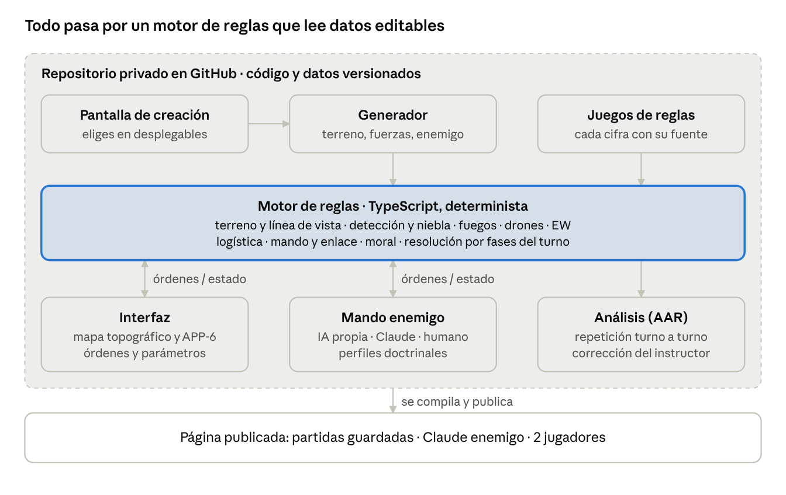
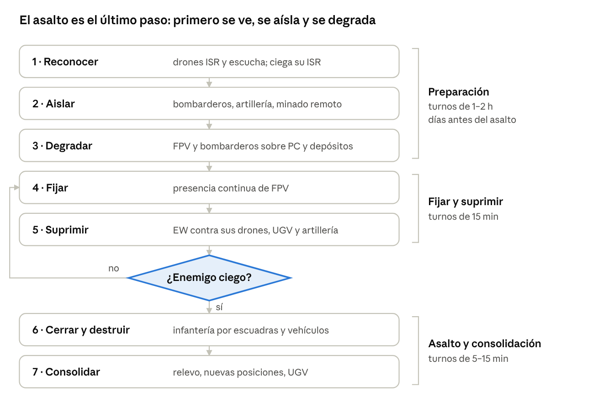
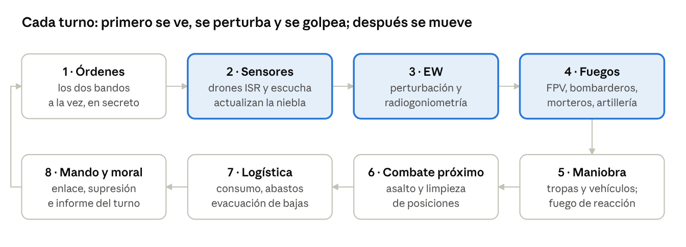
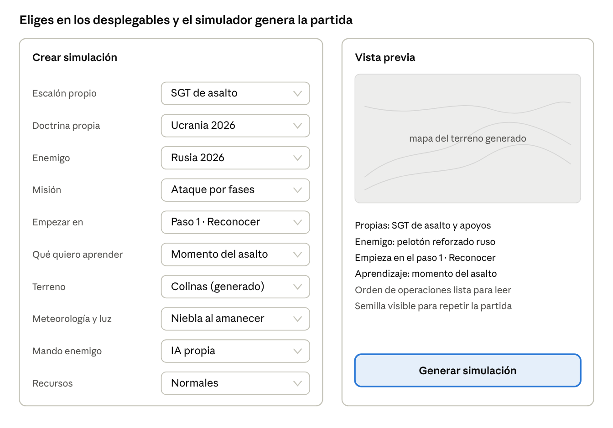

# Simulador táctico SGT · Hoja de ruta

Versión del 4 de octubre de 2026 · Aprobada por Balú. Documento vivo con diagramas: https://claude.ai/code/artifact/c25142f2-eefc-4dfa-b40f-819ca40efba0

## 1. Qué queremos

**Objetivo.** Sustituir los supuestos escritos por un simulador por turnos. Antes de jugar, en una **pantalla de creación** eliges escalón, misión, bandos, terreno y qué quieres aprender, y el simulador genera la partida que corresponde. En ella preparas y conduces la operación como se hace hoy en Ucrania: primero drones, sensores, EW y artillería para ver, aislar y degradar al enemigo, y la maniobra y el asalto al final. El enemigo reacciona, y al terminar recibes una corrección como la de los supuestos.

**Para quién.** Para ti, como instrucción personal, y más adelante para un compañero que pueda llevar al enemigo.

**Qué debe enseñar.** Lo mismo que el plan de instrucción, en este orden de prioridad:

1. Preparar antes de asaltar: ganar la batalla del reconocimiento, aislar y degradar al enemigo antes de mover a la infantería.
2. Decidir el momento del asalto: ¿está ya ciego el enemigo?
3. Leer el terreno: línea de vista, ángulos muertos, vaguadas y espolones.
4. Firma y dispersión: lo que te ve el enemigo y cuándo.
5. La cadena de sensor a tirador: dron que detecta → decisión → golpe.
6. EW: perturbar, detectar emisiones y elegir entre radio y fibra.
7. Logística: baterías, FPV, munición, agua, bajas y UGV.

**Qué NO es.**

- No es un simulador oficial ni sustituye a VBS4 o JCATS.
- No usa datos clasificados ni datos reales de unidades: solo fuentes abiertas.
- No es un videojuego en tiempo real: prima pensar sobre reaccionar rápido.

**Principio de diseño.** Todo número que afecte al resultado es un **parámetro visible y editable** con su fuente. Si un resultado no te convence, se sabe exactamente qué parámetro lo produjo y se cambia.

## 2. Código abierto evaluado

**Conclusión:** no existe un proyecto abierto que haga lo que queremos (tierra, pequeña unidad, drones, EW, logística y turnos). Sí hay piezas que podemos reutilizar y diseños de los que aprender.

| Proyecto | Qué es | Licencia | Uso para nosotros |
| --- | --- | --- | --- |
| [milsymbol](https://www.npmjs.com/package/milsymbol) | Librería que dibuja símbolos APP-6 B/D y MIL-STD-2525 C/D a partir de su código SIDC (código de identificación del símbolo) | MIT (libre) | **La usamos**: todos los símbolos del juego |
| [Tactical](https://github.com/shmuelsh23a/Tactical) | Motor de reglas por turnos para escuadra a compañía, con terreno real, línea de vista, niebla por detección y repetición de la partida (2026) | Propietaria: solo evaluación personal | **Solo como referencia de diseño**: no podemos copiar su código. No tiene drones ni EW |
| [Sandkasten](https://github.com/FPVogel/sandkasten) | Juego de guerra naval y aéreo inspirado en Command: Modern Operations, con niebla por sensores y eventos programables | MIT | **Ideas**: niebla por sensores, pausa automática ante un contacto nuevo, eventos del tipo “si pasa X, entonces Y” |
| [ORBAT Mapper](https://github.com/orbat-mapper/orbat-mapper) | Aplicación web para construir órdenes de batalla y colocar unidades en el mapa a lo largo del tiempo | MIT | **Opcional**: editor externo de escenarios. Valoraremos importar su formato en la versión 3 |
| [Open-CGF](https://manny-systemsengineer.github.io/Open-CGF/) | Fuerzas generadas por ordenador con estándares de simulación distribuida (DIS y HLA) | Sin licencia clara | **Descartado**: pensado para enlazar simuladores profesionales, excesivo para esto |

**Qué aprendemos de ellos:**

- Un motor de reglas **determinista**: misma partida, misma semilla aleatoria y mismas órdenes dan el mismo resultado. Así una partida se puede repetir y analizar (Tactical).
- La niebla debe salir de la **detección real** y no de un radio fijo (Tactical, Sandkasten).
- Separar el **motor** (reglas) de la **interfaz** (mapa y botones), para poder cambiar uno sin romper el otro.

**Lo que construimos nosotros:** el motor de reglas, el mapa a partir del terreno de la Loma del Cuervo, el modelo de drones, EW y logística, el enemigo y el panel de parámetros.

## 3. Arquitectura y herramientas

**Repositorio:** [Meldroide99/SEXTA-FORCE](https://github.com/Meldroide99/SEXTA-FORCE), privado. El código y los parámetros viven ahí, para que no se pierdan entre sesiones y para que cada cambio quede registrado: qué se cambió, cuándo y por qué.

**¿Hace falta Claude Code?** No es imprescindible. Puedo programar, probar y publicar desde aquí si conectas el repositorio a la sesión. Claude Code (en tu ordenador) conviene si quieres ver y tocar el código tú mismo o para sesiones largas de programación. Se puede alternar entre los dos sobre el mismo repositorio.



La pantalla de creación pasa tus elecciones al generador, que construye el terreno, las fuerzas, el despliegue enemigo y la orden de operaciones. El motor de reglas no sabe nada de pantallas: recibe órdenes, aplica las reglas con los parámetros del juego de reglas activo y devuelve lo que sabe cada bando. Por eso el enemigo puede ser la IA propia, Claude o un compañero sin tocar el motor.

**Carpetas del repositorio:**

| Carpeta | Contenido |
| --- | --- |
| `engine/` | Motor de reglas, sin interfaz, con pruebas automáticas |
| `generator/` | Generador de partidas: terreno, fuerzas, despliegue enemigo, eventos y orden de operaciones |
| `rules/` | Juegos de reglas en JSON (formato de datos de texto): cada parámetro con valor, unidad, rango y fuente |
| `templates/` | Plantillas de unidad, perfiles doctrinales y secuencias de pasos por misión |
| `ai/` | IA de utilidad y contratos con Claude (prompts y esquemas de respuesta) |
| `app/` | Interfaz web: pantalla de creación, mapa, símbolos APP-6, órdenes, parámetros y AAR |
| `docs/` | Esta hoja de ruta, las reglas explicadas en lenguaje claro y el registro de decisiones |

**Entrega:** el juego se compila en una sola página publicada en claude.ai que abres en el navegador. Esa página guarda partidas y juegos de reglas, puede consultar a Claude como enemigo y admite dos jugadores a la vez.

**Seguridad:** solo fuentes abiertas. Nada de NOP, plantillas reales de la BRIPAC ni información clasificada en el repositorio.

## 4. La operación por fases

La columna vertebral del simulador es el ataque ucraniano en 7 pasos que describe Jack Watling (RUSI) a partir de entrevistas con unidades de asalto y unidades “no estándar” ucranianas ([RUSI, 23 oct 2025](https://www.rusi.org/explore-our-research/publications/insights-papers/emergent-approaches-combined-arms-manoeuvre-ukraine); difundido por [UNITED24, dic 2025](https://united24media.com/latest-news/drones-robots-and-a-7-phase-plan-how-ukraine-is-rewriting-the-rules-of-war-14047) y [EU Perspectives, ene 2026](https://euperspectives.eu/2026/01/ukraines-playbook-is-rewriting-the-rules-of-war/)). Su resumen: “reconocerlo, aislarlo, degradar al enemigo, fijar sus fuerzas, suprimirlas, cerrar y destruir, y consolidar”.



La partida empieza mucho antes del asalto. En los pasos 1 a 3 no se mueve la infantería: asignas drones de reconocimiento a zonas, bombarderos y artillería a objetivos, minas remotas a rutas y la EW a escuchar. El enemigo hace lo mismo contra ti: caza tus pilotos y tus antenas. Por eso esos pasos se juegan con turnos largos, y los turnos se acortan conforme te acercas al contacto.

| Paso | Qué se hace (Watling) | Indicador que ves en pantalla para decidir si avanzas |
| --- | --- | --- |
| 1 · Reconocer | Localizar defensa antiaérea, rutas de abastecimiento, asentamientos y EW; antes, ganar la batalla del contra-reconocimiento | % de puestos de observación, pilotos, EW y morteros enemigos localizados |
| 2 · Aislar | “Ataque medio” sobre sus apoyos; minas antivehículo y munición de cráter en sus rutas | Abastecimiento enemigo que llega a la posición frente al que consume |
| 3 · Degradar | FPV y bombarderos sobre puestos de mando, polvorines y posiciones, guiados por los mapas térmicos del paso 1 | Puestos de mando y depósitos destruidos |
| 4 · Fijar | Presencia continua de FPV para que no se reorganice ni rote | Movimientos enemigos que se producen |
| 5 · Suprimir | Armas de apoyo infiltradas fuera del eje, EW agresiva contra sus drones, artillería; aprovechar el cruce térmico y el mal tiempo | **Drones enemigos que siguen volando** |
| 6 · Cerrar y destruir | La infantería desembarca y limpia con granadas; los vehículos apoyan con cañón | Posiciones limpias y bajas propias |
| 7 · Consolidar | Relevar a los de asalto, hacer posiciones nuevas en vez de ocupar las enemigas, seguridad | Posición organizada antes del contraataque |

**Tú decides cuándo pasar de paso.** El motor no lo impide ni lo hace por ti: si lanzas el asalto con sus drones volando, las bajas salen solas de las reglas, igual que en la realidad. Watling cifra las bajas en torno al 5 % en terreno favorable y al 10 % en desfavorable cuando se respeta la secuencia, frente a hasta el 50 % en los ataques mal coordinados. La operación también es reversible: si las condiciones empeoran, se vuelve a un paso anterior.

**Datos de Watling que entran como parámetros por defecto:** de 5 a 10 días por sector; zona de contacto de unos 15 km y zona media de unos 30 km más allá; los FPV actúan sobre todo entre 3 km por detrás y 3 km por delante de las posiciones propias; los UGV esperan a 2–5 km de las posiciones avanzadas; y hace falta “un batallón entero” de apoyos para que ataque una compañía.

**Caso real:** la operación Vivaldi (Lymán, junio a septiembre de 2026) siguió esta secuencia. Primero golpeó la logística, los drones y la EW rusos, y después los vehículos llegaron a las fortificaciones sin ser batidos por drones ([Euromaidan / ISW, sep 2026](https://euromaidanpress.com/2026/09/29/vivaldi-counteroffensive-advanced-after-ukraine-took-russias-drones-out-of-the-fight-isw-assesses/)).

**Otras misiones.** La defensa, la infiltración al estilo ruso y el reconocimiento tendrán su propia secuencia de pasos, construida con el mismo método y con sus fuentes en la fase 0 del proyecto.

## 5. El turno

Los dos bandos dan órdenes a la vez y en secreto. Después el motor resuelve siempre en el mismo orden, que reproduce la lógica de la operación: **ver, perturbar y golpear antes de moverse**.



- **Órdenes.** Además de las órdenes del turno, cada medio puede tener una **tarea permanente**: un dron de reconocimiento sobre una zona, un mortero en espera sobre un punto de referencia o la EW escuchando una banda. Es lo que hace jugables los turnos largos de la preparación.
- **Sensores.** Cada sensor tiene una probabilidad de detectar cada unidad enemiga según el tipo de sensor, la distancia, la línea de vista, la firma (moverse, disparar, emitir, calor), la ocultación y la luz y el tiempo. Cada bando ve solo lo que detecta, con su grado de certeza y su antigüedad.
- **EW.** La perturbación corta enlaces por radio dentro de su zona (también los propios si no se coordina); la fibra no se perturba, pero tiene alcance limitado. La escucha localiza emisores y los convierte en objetivo.
- **Fuegos.** FPV y bombarderos como munición que se gasta; morteros y artillería con tiempo de petición, dispersión y riesgo de contrabatería; minado remoto de rutas.
- **Maniobra.** El movimiento aumenta la firma; lo que se mueve bajo un dron enemigo recibe **fuego de reacción** en el mismo turno.
- **Combate próximo.** Solo cuando hay contacto: asalto, granadas y limpieza de posiciones.
- **Logística.** Consumo de baterías, drones, munición, agua y víveres; abastecimiento por UGV, vehículo o a pie; evacuación de bajas.
- **Mando y moral.** Las órdenes tardan según el medio (cable, radio, mensajero); la unidad sin enlace sigue su última orden. Supresión, bajas e informe del turno con lo que cada bando sabe.

## 6. Orgánica y plantillas

La plantilla propia por defecto es el **SGT de asalto de unas 100 personas** que definimos en M3, construido sobre las compañías de asalto ucraniana (100) y rusa (110) de la presentación *LLAA UKR BRIPAC*, el *Russian FPV Tactics Handbook* y RAND (feb 2026). Menos gente, más fuego descentralizado, más drones y células dispersas: una de cada cuatro personas opera drones o EW, y nada de más de 5 va junto.

| Elemento | Efectivos | En el juego |
| --- | --- | --- |
| Mando y C2 | 8 | Nodos de 2–3 con Starlink, ATAK y vídeo en directo; el PC es una red, no un lugar |
| Célula UAS | 22 | 2 puestos de reconocimiento, 3 cálculos FPV, 1 bombardero ligero, 1 relé y FPV de fibra |
| Célula EW / C-UAS | 4 | Espectro, detección y radiogoniometría, interceptación de vídeo FPV |
| Grupos de asalto 1 y 2 | 2 × 20 | 4 escuadras de 5 cada uno, con operador de dron, tirador selecto, sanitario y zapador |
| Apoyo de fuegos | 11 | Contracarro, lanzagranadas automático (LAG), ametralladora pesada, tiradores de precisión |
| Morteros | 4 | 2 piezas que tiran por separado |
| Defensa aérea | 3 | Escopetas, redes, interceptores FPV y vigías |
| Suministro y evacuación | 9 | Porteadores, 3 operadores de UGV y paramédico |
| Agregados | — | Bombarderos pesados, ala fija, UGV armados, minado remoto y artillería del escalón superior |

**Escalones jugables.** La ficha mínima baja cuando bajas de escalón:

| Escalón | Qué mandas | Ficha mínima |
| --- | --- | --- |
| Pelotón | Una escuadra de 5 (jefe, ametralladora, radio, lanzagranadas, fusilero) con el dron de su grupo | Binomio o combatiente |
| Sección | Un grupo de asalto de 20 | Escuadra de 5 |
| SGT | El SGT de asalto completo | Escuadra, célula o puesto |
| GT | El SGT de asalto más los apoyos de batallón que lo hacen posible | Grupo o célula |

El GT se basa en la cifra de Watling: hace falta “un batallón entero” de apoyos para que ataque una compañía. Su composición concreta se define en la fase 0 del proyecto, con fuentes.

**Plantillas enemigas y alternativas:**

- Compañía de asalto rusa de 110 en grupos de 22 (*LLAA UKR BRIPAC*), con infiltración de 1–3 hombres, puestos avanzados, corredores de drones, motos y morteros (RAND; Forbes, jun 2026).
- Defensa rusa en núcleos de 2–4, con puestos de observación, puestos de pilotos y morteros por piezas.
- Sección de asalto de 7 de Watling (2 equipos de 3 y su jefe; 12–15 cargadores y 4–6 granadas, con reabastecimiento por dron), como alternativa a la escuadra de 5.

Todas las plantillas son datos editables. En la fase 2 podrás crear las tuyas con un editor.

## 7. Pantalla de creación de simulación

No hay escenarios fijos: cada partida se genera a partir de lo que eliges en los desplegables.



| Desplegable | Opciones | Qué cambia en la partida |
| --- | --- | --- |
| Escalón propio | Pelotón · Sección · SGT · GT | Fuerza propia, ficha mínima, duración de los turnos, qué apoyos mandas tú y cuáles pides al escalón superior |
| Doctrina propia | Ucrania 2026 · Rusia 2026 · España/OTAN con drones | Plantillas, secuencia de pasos y juego de reglas por defecto |
| Enemigo | Rusia 2026 · Ucrania 2026 · OTAN, y su tamaño: inferior, igual o superior | Plantilla, despliegue y perfil de la IA |
| Misión | Ataque por fases · Defensa de posición · Infiltración · Reconocimiento y contra-reconocimiento · Contraataque · Relevo bajo drones | Secuencia de pasos, objetivos y condiciones de victoria |
| Empezar en | Paso 1, la operación completa · Paso 4, con la preparación ya hecha por el escalón superior y resultado variable · Paso 6, solo el asalto | Duración de la partida y estado inicial del enemigo |
| Qué quiero aprender | Preparar el ataque · Momento del asalto · Lectura del terreno · Firma y dispersión · Cadena sensor-tirador · EW · Logística y evacuación · Todo | Eventos que ponen a prueba ese punto y en qué se fija la corrección |
| Terreno | Colinas · Llanura agrícola con franjas de árboles · Periurbano · Río y vados · Bosque · Real (fase 3) | Mapa generado y avenidas de aproximación |
| Meteorología y luz | Aleatoria · Despejado · Niebla · Lluvia · Noche, y estación del año | Detección, vuelo de drones, cruce térmico y altura de la vegetación |
| Mando enemigo | IA propia · Claude · Compañero | Quién decide por el enemigo |
| Recursos | Escasos · Normales · Abundantes | FPV por día, munición, baterías y apoyos disponibles |

**Cómo se genera la partida al pulsar el botón:**

1. **Semilla.** Se sortea y se muestra. Misma semilla y mismas opciones dan la misma partida.
2. **Terreno.** El generador lo construye a partir de la red de drenaje, como el de la Loma del Cuervo, según el tipo elegido.
3. **Fuerzas.** Salen de las plantillas del escalón y la doctrina elegidos.
4. **Despliegue enemigo.** Lo colocan las reglas de su perfil doctrinal sobre el terreno real del mapa: núcleos pequeños, huecos vigilados por drones, señuelos, puestos de observación con vista, morteros por piezas y pilotos tras la cresta.
5. **Misión.** Objetivos y condiciones de victoria según la plantilla de misión.
6. **Eventos.** Se eligen según lo que quieres aprender. Por ejemplo, si eliges EW, el enemigo perturba mucho y usa drones de fibra; si eliges logística, la evacuación es larga y puedes perder un UGV.
7. **Orden de operaciones.** Se genera en los 5 párrafos (situación, misión, ejecución, apoyo logístico, mando y transmisiones) y la lees antes del primer turno. Claude puede redactarla en lenguaje natural, pero los datos salen del generador.
8. **Comprobación.** El generador verifica que la partida es jugable: hay rutas, el objetivo es alcanzable y las fuerzas caben en el terreno.

## 8. Estado, restricciones y contrato con Claude

El prompt de Gemini acierta en casi todo lo que propone para ordenar la simulación, pero se equivoca en lo principal: hacer de Claude el motor de reglas. Un modelo de lenguaje no es determinista ni se puede probar automáticamente: ante la misma situación puede dar resultados distintos. Por eso las reglas y los dados van en código, y Claude solo decide y explica.

| Idea del prompt de Gemini | Qué hacemos |
| --- | --- |
| Definir el bucle principal | Es el turno de 8 fases (apartado 5) dentro de la operación por pasos (apartado 4) |
| Matriz de variables | **La adoptamos**: el estado de la partida es un objeto JSON con las variables de abajo, guardado turno a turno |
| Árbol de restricciones | **La adoptamos, pero la aplica el motor**: una orden imposible se rechaza antes de resolverse y se explica por qué |
| Etiquetas XML y formato de salida estricto | **Lo adoptamos** para las tres tareas de Claude (jefe enemigo, árbitro e instructor): devuelve JSON que se valida contra un esquema |
| Bloque de estado y “prompts de mantenimiento” | **No hace falta**: Claude no guarda el estado. Cada llamada es independiente y recibe solo lo que su bando sabe en ese turno, así que no se degrada a los 20 turnos |
| Claude como motor de reglas | **No**, por lo dicho arriba |
| API de Anthropic con Make o Zapier | **No hace falta ahora**: la página publicada consulta a Claude directamente. Si algún día sale de claude.ai, se usaría la API sin intermediarios |
| Generación procedural con Claude | **Sí, acotada**: Claude propone variantes y redacta la orden de operaciones, y el generador coloca las unidades para garantizar que la partida es válida |

**Matriz de variables (estado de la partida):**

- **Global:** semilla, turno, hora, paso de la operación, luz, meteorología y juego de reglas activo.
- **Por unidad:** posición, efectivos y bajas, estado (operativa, suprimida o destruida), munición, baterías, drones por tipo, moral, enlace, firma actual, orden actual y tarea permanente.
- **Por bando:** imagen de contactos (qué cree que hay, dónde, con qué certeza y desde cuándo), puntos de referencia, corredores EW, depósitos, rutas de abastecimiento y bajas acumuladas.
- **Indicadores de la operación:** porcentaje del enemigo localizado, abastecimiento enemigo, puestos de mando y depósitos destruidos, drones enemigos operativos y bajas propias frente a la referencia de Watling.

**Árbol de restricciones (ejemplos):**

- Un dron no vuela más allá de su enlace ni más tiempo que su batería.
- Un FPV por radio no golpea dentro de una zona perturbada; uno de fibra no pasa de la longitud de su bobina.
- Nadie dispara sin munición ni ve sin línea de vista o sensor.
- Una unidad no se mueve más rápido de lo que permiten el terreno y su carga.
- Una orden a una unidad sin enlace no llega hasta que se restablece.
- La IA enemiga y Claude solo conocen lo que su bando ha detectado: nunca ven tu despliegue real.

**Contrato con Claude como jefe enemigo** (esqueleto; los textos completos se escriben en la fase 0):

```
<rol_y_tono>Jefe del bando enemigo, doctrina {perfil}. Sobrio y doctrinal.</rol_y_tono>
<situacion>{JSON: lo que su bando sabe, misión, medios y paso de la operación}</situacion>
<mecanicas_del_juego>{reglas y restricciones que afectan a sus decisiones}</mecanicas_del_juego>
<formato_de_salida>Solo JSON: {"intencion": "...", "ordenes": [{"unidad": "...", "accion": "...", "destino": "...", "objetivo": "...", "tarea_permanente": "..."}], "razonamiento": "..."}</formato_de_salida>
```

Si alguna orden incumple una restricción, el motor se la devuelve una vez con el motivo. Si vuelve a fallar, la IA propia completa el turno, y la partida nunca se queda bloqueada.

## 9. Parámetros editables

Antes de cada partida, en la misma pantalla de creación, eliges un **juego de reglas** y puedes cambiar cualquier cifra en el panel de parámetros. Lo que cambies se guarda como un juego nuevo, y cada partida registra con qué juego se jugó, así un resultado siempre se puede explicar y repetir.

**Cada parámetro lleva:** nombre, valor, unidad, rango permitido, fuente y fecha, confianza (alta si es un dato publicado, media si es una estimación razonada, baja si es un supuesto a validar) y la fase del turno a la que afecta.

**Juegos de reglas iniciales:** “Ucrania 2026” (por defecto), “Rusia 2026” y “Doctrina OTAN”, más los que crees tú.

| Categoría | Ejemplos de parámetros | Valores con fuente ya disponibles |
| --- | --- | --- |
| Operación | Duración por paso, turno por paso, profundidad de las zonas | 5–10 días por sector; zona de contacto de ~15 km y zona media de ~30 km más allá ([RUSI](https://www.rusi.org/explore-our-research/publications/insights-papers/emergent-approaches-combined-arms-manoeuvre-ukraine)) |
| Detección | Probabilidad base y alcance por sensor; modificadores por firma, ocultación, noche y niebla | Fase 0 |
| Drones | Autonomía, alcance por radio y por fibra, probabilidad de impacto, drones por misión y por día | Escolta de 1 dron de reconocimiento y 3–5 FPV; enjambre de 5–12 (*FPV Handbook*); ~30 FPV diarios por cada 2,5 km de frente (*Lecciones BPAC II*); FPV sobre todo entre −3 y +3 km (RUSI) |
| EW | Radio de perturbación, efecto por tipo de enlace, probabilidad de localizar un emisor | Fase 0 |
| Fuegos | Tiempo de respuesta, dispersión, munición, contrabatería | Morteros por piezas separadas por la contrabatería (*LLAA UKR BRIPAC*) |
| Logística | Consumos, capacidad y riesgo del UGV, evacuación | UGV a 2–5 km de las posiciones avanzadas (RUSI); evacuaciones de 500 m a 2 km bajo fuego (*LLAA*); ~90 % del abastecimiento por UGV cerca de Pokrovsk ([ESD, mar 2026](https://euro-sd.com/2026/03/articles/armed-forces/49802/infantry-tactical-insights-from-ukraine/)) |
| Despliegue | Núcleos, huecos, señuelos, infiltración | Núcleos de 2–8 y huecos de 1–3 km (ESD); al menos 50 % de señuelos ([ICDS, sep 2025](https://icds.ee/en/russias-war-in-ukraine-fortification-for-drone-warfare/)); infiltración de 1–3 ([Kyiv Post / ISW, ago 2026](https://www.kyivpost.com/post/82495)) |
| Resultados de referencia | Bajas esperadas por tipo de ataque, para calibrar y corregir | ~5 % en terreno favorable, ~10 % en desfavorable, hasta 50 % si se ataca sin preparar (RUSI) |
| Mando y enlace | Retardo de la orden por medio, alcance radio | Fase 0 |
| Moral y supresión | Umbrales de supresión, efecto de bajas y de aislamiento | Fase 0 |

Lo que figura como “Fase 0” se investiga con fuentes y te lo presento para validar antes de programar. No invento ninguna cifra.

## 10. Fases del proyecto y entregables

Cada fase termina con algo que puedes probar y un criterio de aceptación. No se pasa a la siguiente sin tu visto bueno.

| Fase | Contenido | Criterio de aceptación |
| --- | --- | --- |
| **0 · Especificación** | Esta hoja de ruta en el repositorio; reglas de cada fase del turno escritas en lenguaje claro; catálogo de parámetros con fuentes; secuencias de pasos para defensa, infiltración y reconocimiento; composición del GT; formatos de estado, escenario y juego de reglas; textos completos de los prompts de Claude | Apruebas reglas, parámetros y secuencias |
| **1 · Primera partida** | Pantalla de creación completa (las opciones aún no hechas, marcadas como “próximamente”); generador de terreno de colinas; ataque por fases en los 7 pasos a escala SGT, Ucrania contra Rusia; motor de las 8 fases del turno; IA propia con perfil ruso; panel de parámetros; guardado; AAR básico | Juegas una operación completa desde el paso 1; misma semilla y mismas órdenes dan el mismo resultado; toda cifra que influye aparece en el panel |
| **2 · Escalones y misiones** | Pelotón, sección y GT; defensa, infiltración, reconocimiento, contraataque y relevo; perfiles ucraniano y OTAN; editor de plantillas y de juegos de reglas | Cualquier combinación de escalón y misión genera una partida jugable |
| **3 · Terrenos** | Llanura con franjas de árboles, periurbano, río y bosque; importador de terreno real, empezando por España | Generas cada tipo y juegas en él con línea de vista correcta |
| **4 · Claude y dos jugadores** | Claude como jefe enemigo; modo compañero con Claude como árbitro; corrección del instructor en el AAR | Una partida completa en cada modo |
| **5 · Avanzado** | Reglas escritas en texto, IA que aprende jugando, importación de escenarios de ORBAT Mapper | Se decide al terminar la fase 4 |

**Regla de cambios:** todo cambio entra en el repositorio con una nota de qué se cambió y por qué. Si es una regla, se actualiza también su explicación, y las pruebas automáticas comprueban que lo anterior sigue funcionando.

## 11. Decisiones y lo que necesito de ti

**Decisiones tomadas:**

- La operación sigue los 7 pasos de Watling: primero sensores, drones, EW y artillería; el asalto, al final.
- No hay escenarios fijos: la pantalla de creación genera cada partida.
- La plantilla por defecto es el SGT de asalto de M3, con escuadras de 5. La sección de 7 de Watling queda como alternativa.
- Las reglas y el estado viven en el código. Claude actúa como jefe enemigo, árbitro e instructor, nunca como motor.
- Lo que se hace ahora y lo que se deja para después: IA de utilidad ahora e IA que aprende después; terrenos generados ahora y España real después; panel de parámetros ahora y reglas escritas después.

**Lo que necesito de ti:**

1. ~~GitHub~~: hecho, `Meldroide99/SEXTA-FORCE`.
2. ~~Visto bueno a la hoja de ruta~~: aprobada el 4 de octubre de 2026.
3. ~~Dispositivo principal~~: ordenador; tableta como uso secundario. El móvil queda fuera del diseño.
4. **Validar la matriz de parámetros de la fase 0** (pestaña “Fase 0 · Parámetros”): sobre todo las decisiones marcadas como pendientes.
